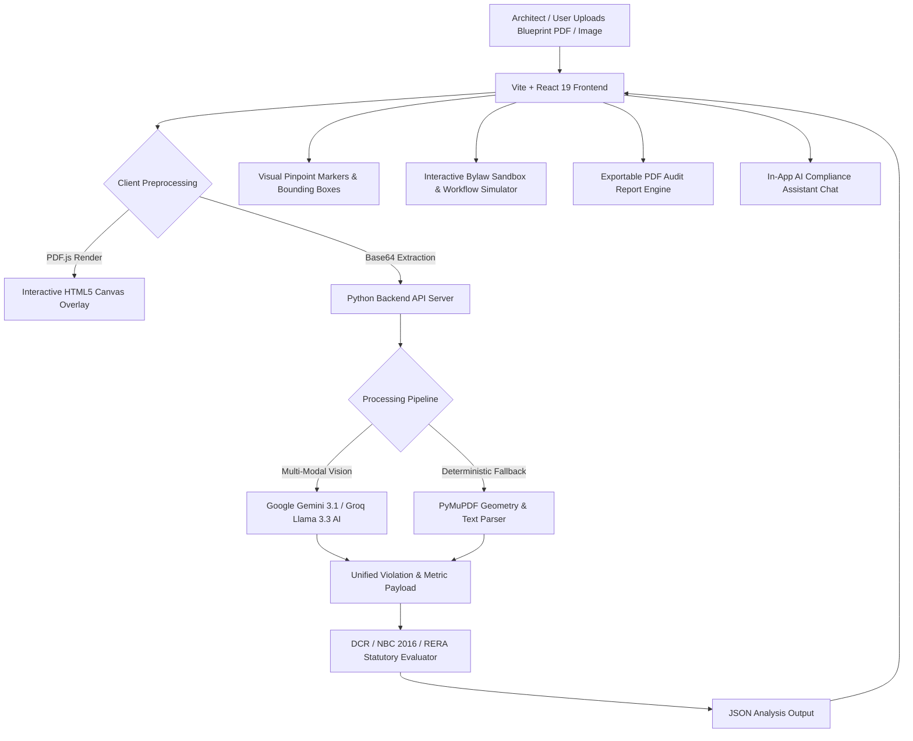

# 🏢 PRUDENCE AI – Automated Architectural & Civil Blueprint Compliance Engine

[](https://sih.gov.in/)
[](https://sih.gov.in/)
[](https://react.dev/)
[](https://www.typescriptlang.org/)
[](https://deepmind.google/technologies/gemini/)
[](LICENSE)

---

## 🇮🇳 Smart India Hackathon 2026 (SIH 2026) Project Overview

| Metric / Attribute | Project Details |
| :--- | :--- |
| **Hackathon** | **Smart India Hackathon 2026 (SIH 2026)** |
| **Problem Statement Category** | **Open Innovation** |
| **Domain / Theme** | **Smart Cities, Urban Planning & Digital Governance (E-Governance)** |
| **Project Title** | **PRUDENCE AI – Multi-Statutory Building Plan Compliance Engine** |
| **Primary Statutory Standards** | **DCR (Development Control Regulations)**, **NBC 2016 (National Building Code of India)**, **RERA** |
| **Core Innovation** | **Hybrid Multi-Modal Vision AI + Deterministic Geometry Fallback Engine with Live Canvas Overlays & 3D Spatial Holograms** |

---

## 🎯 Problem Statement & Background

In India’s rapidly growing urban landscape, **architectural building plan approval** by Municipal Corporations and Urban Local Bodies (ULBs) is a major bottleneck:

1. ⏳ **Massive Processing Delays**: Manual review of complex floor plans, CAD drawings, and multi-page PDF blueprints takes **30 to 90+ days**.
2. ⚠️ **Safety Hazards & Non-Compliance**: Oversight of critical safety norms—such as **NBC 2016 fire tender access**, **ramp slopes**, or **corridor widths**—leads to hazardous structures.
3. 💸 **High Compliance Costs & Lack of Transparency**: Subjective manual interpretation creates opaque approval workflows and increases project holding costs for real estate developers and citizens.

### 💡 The Open Innovation Solution: PRUDENCE AI
**PRUDENCE AI** transforms building plan clearance into an automated, transparent, and instantaneous process. By combining **Multi-Modal Vision AI (Gemini 3.1 / Groq Llama 3.3)** with a **deterministic local geometric calculation engine**, PRUDENCE AI scans CAD blueprints, detects non-compliant zones, overlay interactive visual pinpoints, and generates municipal audit reports in seconds.

---

## ✨ Key Features & Technical Innovations

### 1. 📐 Multi-Statutory Rule Engine
* **DCR (Development Control & Promotion Regulations)**:
  * Automatic verification of **Front, Side, & Rear Setbacks** based on plot area and building height.
  * Validation of **FSI (Floor Space Index) / FAR (Floor Area Ratio)** limits and **Ground Coverage %**.
  * Access **Road Width requirements** based on building classification (Residential, Commercial, Industrial).
* **NBC 2016 (National Building Code of India)**:
  * **Fire Tender Access**: Gate width (min 6.0m) and turning radius verification.
  * **Life Safety**: Ramp slopes (max 1:10 gradient), main staircase clear width (min 1.5m), and corridor widths.
  * **Plinth & Structural**: Minimum plinth height (450mm above road level) and maximum building height restrictions.
* **RERA (Real Estate Regulatory Authority)**:
  * Automated carpet area calculation vs. built-up area disclosures to safeguard homebuyer rights.

### 2. 🎯 Interactive Blueprint Canvas & Annotation Overlays
* Instant rendering of multi-sheet PDF drawings using **PDF.js** and HTML5 Canvas.
* Color-coded bounding boxes (**RED** = Critical Violation, **AMBER** = Warning, **GREEN** = Compliant).
* Interactive pinpoint markers on non-compliant rooms, staircases, and boundary walls.

### 3. 🧪 Interactive Bylaw Limits Tester & Workflow Simulator
* **Interactive Bylaw Sandbox** (`src/components/InteractiveBylawTester.tsx`): Test custom plot dimensions, road widths, and building heights with instant statutory PASS/FAIL feedback.
* **Approval Workflow Simulator** (`src/components/InteractiveWorkflowSimulator.tsx`): Multi-stage municipal sanction simulation (Submission -> Statutory Screening -> AI Vision Check -> Department Approval -> NOC Issuance).

### 4. 🏢 3D Wireframe Spatial Model Projection
* Interactive **WebGL Three.js canvas** (`src/components/ThreeBuildingBackground.tsx`) offering a 3D wireframe spatial projection of floor plan extrusions and setback clearances.

### 5. 🤖 Dual-Engine AI Architecture & Fallback
* **Primary AI Engine**: Google Gemini 3.1 Flash / Groq (Llama 3.3 70B) for multi-modal spatial reasoning.
* **Deterministic Fallback**: Local PyMuPDF (fitz) text and line-segment parsing engine, ensuring 100% offline uptime even if cloud AI APIs are unreachable.

### 6. 💬 Context-Aware AI Chat & 📄 Exportable PDF Audit Reports
* Embedded in-app AI Chat Drawer grounded in the specific plan violations.
* One-click downloadable PDF audit report complete with statutory citations, deficit metrics, and corrective measures.

---

## 🏗️ System Architecture & Data Flow



---

## 🏛️ Supported Statutory Standards Summary

| Statutory Body / Code | Evaluated Metrics & Rules | Statutory Baseline |
| :--- | :--- | :--- |
| **DCR (Dev Control Rules)** | Plot Setbacks (Front, Rear, Side) | Min 3.0m - 6.0m dependent on height |
| **DCR (Dev Control Rules)** | FSI / FAR Ratio | Permissible range 1.50 - 2.50 |
| **DCR (Dev Control Rules)** | Ground Coverage | Max 40% - 60% of total plot area |
| **NBC 2016 (Fire & Safety)** | Fire Tender Entrance Gate | Minimum clear width 6.0 meters |
| **NBC 2016 (Life Safety)** | Vehicular Ramp Gradient | Maximum slope 1:10 (10%) |
| **NBC 2016 (Life Safety)** | Main Exit Staircase Clear Width | Minimum 1.5 meters clear width |
| **NBC 2016 (Building Code)** | Building Plinth Elevation | Minimum 450 mm above ground/road level |
| **RERA** | Carpet Area Verification | Matches sanctioned disclosure schedule |

---

## 📁 Repository Structure

```
PRUDENCE-ai/
├── api/                        # Vercel Serverless Functions & Rule Engine
│   ├── analyze-file.js         # Endpoint for PDF/image vision analysis
│   ├── analyze.js              # Plan analysis orchestrator
│   └── rules.js                # DCR, NBC 2016, and RERA rule definitions
├── backend/                    # FastAPI Backend Service
│   ├── main.py                 # FastAPI endpoints & CORS middleware
│   ├── run.py                  # Service entrypoint
│   └── requirements.txt        # Python dependencies (fitz, fastapi, uvicorn)
├── localhost/                  # Standalone Python Threading Server
│   ├── server.py               # Local server with Gemini/Groq + Fallback Engine
│   ├── index.html              # Standalone web GUI
│   └── chat.html               # Standalone chat GUI
├── public/                     # Static assets & PDF.js workers
├── scripts/                    # Serving & deployment utilities
├── src/                        # React 19 + TypeScript Application Source
│   ├── components/             # Interactive UI Modules
│   │   ├── InteractiveBylawTester.tsx        # Bylaw limit sandbox
│   │   ├── InteractiveWorkflowSimulator.tsx  # Municipal approval simulator
│   │   └── ThreeBuildingBackground.tsx       # 3D WebGL background model
│   ├── agents/                 # Multi-agent Python orchestration code
│   ├── App.tsx                 # Main Application Layout & Logic
│   ├── index.css               # Global Stylesheet & Tailwind CSS utilities
│   └── main.tsx                # React Root Entry Point
├── .env.example                # Environment Variable Template
├── index.html                  # Vite HTML Entry
├── package.json                # Frontend dependencies & scripts
├── tailwind.config.js          # Tailwind CSS configuration
├── tsconfig.json               # TypeScript configuration
├── vercel.json                 # Vercel deployment configuration
└── vite.config.ts              # Vite bundler configuration
```

---

## ⚙️ Quick Start & Setup Guide

### Prerequisites
* **Node.js**: v18.x or higher
* **Python**: v3.9 or higher
* **npm**: v9.x or higher

### 1. Clone Repository & Install Dependencies

```bash
git clone https://github.com/sahil-exe-17/Prudence-ai.git
cd Prudence-ai

# Install Node.js frontend dependencies
npm install

# Install Python backend dependencies (optional for local API)
pip install -r backend/requirements.txt
```

### 2. Configure Environment Variables

Copy `.env.example` to `.env`:

```bash
cp .env.example .env
```

Add your API Keys inside `.env`:

```ini
GEMINI_API_KEY=your_google_gemini_api_key_here
GROQ_API_KEY=your_groq_api_key_here
PRUDENCE_GROQ_MODEL=llama-3.3-70b-versatile
```

### 3. Launch Application

To run the complete stack (**React Web Client** + **Python API Server**) concurrently:

```bash
npm run dev
```

* **Frontend Client**: `http://127.0.0.1:5173`
* **Python API Server**: `http://127.0.0.1:5174`

---

## 🔌 API Reference

The Python backend exposes the following REST API endpoints:

### `POST /api/analyze-file`
* **Description**: Accepts a base64-encoded PDF blueprint or image file. Runs multi-modal AI vision checks and geometric line parsing.
* **Payload**: `{ "file": "data:application/pdf;base64,...", "filename": "plan.pdf" }`
* **Response**: Returns detected room dimensions, setbacks, NBC 2016 violations, and visual pinpoint coordinates.

### `POST /api/analyze`
* **Description**: Evaluates structured plan metrics against DCR, NBC 2016, and RERA rule packs.
* **Payload**: `{ "setbackFront": 2.5, "fsi": 2.1, "rampSlope": "1:8", "rules": ["DCR", "NBC"] }`
* **Response**: Statutory PASS/FAIL status, metric deficits, and rule clause references.

### `POST /api/chat`
* **Description**: Context-aware AI assistant endpoint grounded in active blueprint analysis.
* **Payload**: `{ "message": "Why did NBC fire gate fail?", "context": { ... } }`

---

## 🇮🇳 Impact & Alignment with National Missions

PRUDENCE AI directly aligns with key initiatives under **Digital India** and the **Smart Cities Mission**:

* 🏙️ **Ease of Doing Business (EoDB)**: Accelerates building plan approvals from months to minutes, fostering rapid urban development.
* 🏛️ **Transparent Governance**: Eliminates human subjectivity and discretionary corruption in municipal plan approvals.
* 🚒 **Life Safety Guarantee**: Enforces 100% compliance with NBC 2016 fire safety guidelines, preventing structural hazards before ground construction begins.

---

## 📄 License

This project is open-source under the **[MIT License](LICENSE)**.

---

<p center>
  Made with ❤️ for <b>Smart India Hackathon 2026 (Open Innovation)</b>
</p>
