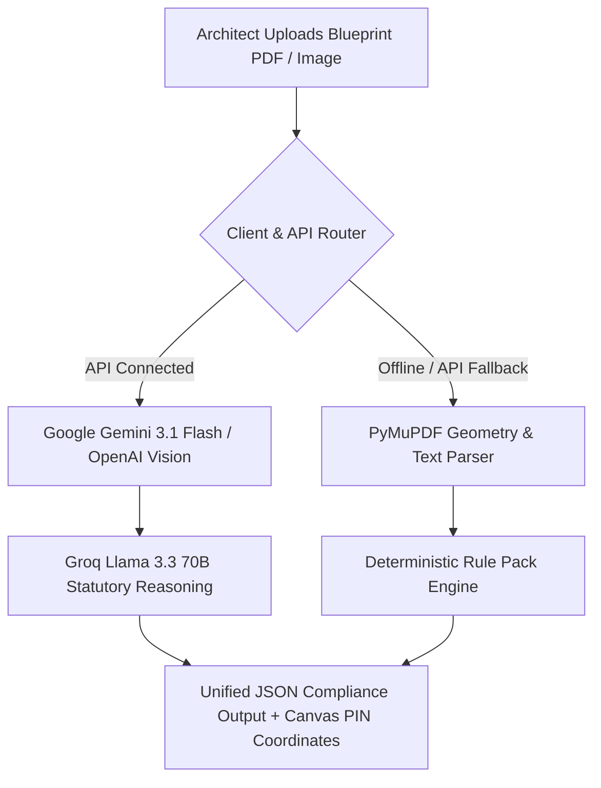

# Technical Stack & System Architecture Specification
## PRUDENCE AI — SIH 2026 Open Innovation

---

## 1. Executive Summary & Core Purpose

**PRUDENCE AI** is an automated multi-statutory building plan compliance engine designed for urban local bodies (ULBs), municipal officers, architects, and structural engineers. It accelerates the validation of complex CAD blueprint drawings and architectural PDFs from standard 30–90 day manual reviews to real-time automated visual and statutory checks.

The application evaluates plans against primary Indian Statutory Standards:
- **DCR (Development Control & Promotion Regulations)** (e.g., DCPR 2034, BBMP Bylaws)
- **NBC 2016 (National Building Code of India)** (Part 4 Fire & Life Safety)
- **RERA (Real Estate Regulatory Authority)** (Carpet area tolerance & compliance disclosures)

---

## 2. Comprehensive Technology Stack

### 2.1 Frontend Client Stack

```
┌─────────────────────────────────────────────────────────────────────────┐
│                      FRONTEND CLIENT (React 19 + Vite)                  │
│  - App.tsx (Main Workspace & Navigation Controller)                     │
│  - Interactive HTML5 Blueprint Canvas & PDF.js Rendering                │
│  - ThreeBuildingBackground (Three.js 3D WebGL Wireframe Model)          │
│  - Interactive Workflow & Bylaw Sandbox Simulators                      │
└─────────────────────────────────────────────────────────────────────────┘
```

| Layer / Library | Version | Description & Specific Usage |
| :--- | :--- | :--- |
| **Framework** | React 19 (`react`, `react-dom`) | Single Page Application framework managing global state, active sheet navigation, audit drawers, and modal views. |
| **Build Tool & Bundler** | Vite 7.1 (`vite`, `@vitejs/plugin-react`) | Next-generation dev server & production bundler configured with API proxying to `127.0.0.1:5174`. |
| **Language** | TypeScript 5.9 (`typescript`, `.tsx`, `.ts`) | End-to-end static typing for rule pack interfaces, violation objects, pin coordinate models, and API payloads. |
| **3D Graphics Engine** | Three.js (`three`, `@types/three`) | Renders an interactive 3D WebGL wireframe architectural building model in [`ThreeBuildingBackground.tsx`](file:///c:/Users/Sahil%20Lale/Downloads/PRUDENCE-main/PRUDENCE-main/src/components/ThreeBuildingBackground.tsx). |
| **PDF Blueprint Parser** | PDF.js (`pdfjs-dist`) | Client-side rendering of multi-sheet vector blueprint PDFs onto interactive HTML5 canvases with responsive auto-fit viewport math and glowing PIN coordinate markers. |
| **Styling & Design** | TailwindCSS 3.4 + Vanilla CSS (`index.css`) | Modern dark-mode aesthetic using HSL color tokens (`#08090a` slate background, `#81b7c2` spatial cyan, `#f26a3d` warm accent), laser scanner animations, and glowing button pill mechanics. |
| **Animations & UI** | Framer Motion 13 (`framer-motion`) | Dynamic UI transitions, morphing text, gooey search input (`GooeySearch.tsx`), and smooth modal popovers. |
| **Iconography** | Lucide React (`lucide-react`) | Responsive icons across municipal dashboards, violation status badges, and export action buttons. |
| **Utility Libraries** | `clsx`, `tailwind-merge` | Conditional class merging and responsive layout utilities. |

---

### 2.2 Dual Backend & API Architecture

```
┌─────────────────────────────────────────────────────────────────────────┐
│                       BACKEND API & RULE ENGINE                         │
│  - Local Python HTTP Server (localhost/server.py on port 5174)         │
│  - FastAPI Service (backend/main.py with PyMuPDF / fitz parsing)       │
│  - Vercel Serverless Functions (api/analyze-file.js, api/chat.js)       │
│  - Statutory Rule Pack Engine (api/rules.js & DCR/NBC/RERA Evaluator)   │
└─────────────────────────────────────────────────────────────────────────┘
```

#### A. Standalone Local Python HTTP Server
- **Implementation**: Python 3.x `ThreadingHTTPServer` (`localhost/server.py`) running on `127.0.0.1:5174`.
- **Endpoints**:
  - `POST /api/analyze-file`: Decodes base64 blueprints, extracts vector/text elements, invokes Gemini/Groq vision pipelines, or runs local geometry rule fallback.
  - `POST /api/analyze`: Evaluates structured plan dimensions against DCR, NBC 2016, and RERA rule packs.
  - `POST /api/chat`: Context-grounded AI assistant endpoint for blueprint violation Q&A.

#### B. FastAPI Backend Service
- **Implementation**: FastAPI 0.124 (`backend/main.py`) served with Uvicorn 0.38 (`uvicorn`).
- **Dependencies**: `fastapi`, `uvicorn[standard]`, `python-multipart`, `PyMuPDF` (`fitz`).

#### C. Vercel Serverless Functions
- **Implementation**: Node.js ESM endpoints in `api/` (`analyze-file.js`, `analyze.js`, `chat.js`, `rules.js`).
- **Deployment**: Enables serverless API execution when deployed to Vercel edge infrastructure.

---

### 2.3 Dual-Engine AI & Vision Architecture

PRUDENCE AI features a **Hybrid Multi-Modal Vision + Deterministic Geometry Fallback**:



1. **Multi-Modal Vision Engine**:
   - **Google Gemini API**: `gemini-3.1-flash-lite` for visual detection of room boundaries, dimension callouts, title block details, and $(x, y)$ coordinate percentage positioning for map markers.
   - **OpenAI Vision Fallback**: `gpt-4o-mini` API integration for visual drawing extraction when configured.
2. **High-Speed Statutory Reasoning**:
   - **Groq LLM**: `llama-3.3-70b-versatile` / `openai/gpt-oss-120b` for high-throughput natural language statutory reasoning, violation explanation, and compliance recommendations.
3. **Deterministic Local Fallback Engine**:
   - **PyMuPDF (`fitz`) + Local Regex & Rule Matcher**: Extracts text lines, line segment geometry, and statutory numbers directly from local files. Guarantees 100% offline uptime and zero-downtime compliance verification even if cloud LLM APIs are unreachable.

---

## 3. Statutory Bylaws & Rule Evaluation Matrix

| Statutory Code | Source Reference | Evaluated Rules & Tolerance Metrics |
| :--- | :--- | :--- |
| **DCR (Dev Control Rules)** | DCPR 2034 / BBMP Bylaws | Rear setback ($\ge 4.0\text{m}$), Front setback ($\ge 6.0\text{m}$), Side setback ($\ge 3.0\text{m}$), FSI/FAR ratio limits, Ground coverage %, Access road width ($\ge 6.0\text{m}$), Car parking deficit checks. |
| **NBC 2016** | Part 4 Fire & Life Safety | Main entrance gate width ($\ge 6.0\text{m}$), Gate vertical clearance ($\ge 4.5\text{m}$), Turning radius ($\ge 9.0\text{m}$), Vehicle ramp slope ($\le 1:10$), Staircase clear width ($\ge 1.5\text{m}$), Plinth height ($\ge 450\text{mm}$). |
| **RERA 2016** | RERA Act 2016 | Unit carpet area disclosure tolerance ($\le 1.4\%$), RERA registration status validation, Sanctioned plan & commencement certificate verification. |

---

## 4. Key Repository Files & Structure

```
PRUDENCE-ai/
├── api/                        # Vercel Serverless Functions & Rule Engine
│   ├── analyze-file.js         # Endpoint for PDF/image vision analysis
│   ├── analyze.js              # Plan analysis orchestrator
│   ├── chat.js                 # Context-aware chat proxy
│   └── rules.js                # DCR, NBC 2016, and RERA rule definitions
├── backend/                    # FastAPI Backend Service
│   ├── main.py                 # FastAPI endpoints & CORS middleware
│   ├── run.py                  # Service entrypoint
│   └── requirements.txt        # Python dependencies (fastapi, uvicorn, python-multipart)
├── localhost/                  # Standalone Python Threading Server
│   ├── server.py               # Local server with Gemini/Groq + Fallback Engine
│   ├── index.html              # Standalone web GUI
│   └── chat.html               # Standalone chat GUI
├── public/                     # Static assets & PDF.js workers
├── src/                        # React 19 + TypeScript Application Source
│   ├── components/             # Interactive UI Modules
│   │   ├── FlipFadeText.tsx                  # Flip fade text component
│   │   ├── GenerateButton.tsx                # Glow button pill component
│   │   ├── GooeySearch.tsx                   # Gooey filter search bar
│   │   ├── InteractiveBylawTester.tsx        # Bylaw limit sandbox
│   │   ├── InteractiveWorkflowSimulator.tsx  # Municipal approval simulator
│   │   ├── MorphText.tsx                     # Morphing text animation
│   │   └── ThreeBuildingBackground.tsx       # 3D WebGL background model
│   ├── App.tsx                 # Main Application Workspace & Visual Canvas Logic
│   ├── index.css               # Global Stylesheet & Tailwind CSS tokens
│   └── main.tsx                # React Root Entry Point
├── docs/                       # Complete SIH 2026 Documentation Suite
│   ├── 01_PRD_Project_Requirements_Document.md
│   ├── 02_Tech_Stack.md
│   └── ...
├── package.json                # Dependencies and npm scripts
├── tailwind.config.js          # Tailwind CSS configuration
├── tsconfig.json               # TypeScript compiler config
├── vercel.json                 # Vercel serverless deployment routes
└── vite.config.ts              # Vite bundler configuration with localhost proxy
```

---

## 5. Quick Start & Execution Commands

```bash
# Clone the repository
git clone https://github.com/sahil-exe-17/Prudence-ai.git
cd Prudence-ai

# Install Node.js frontend dependencies
npm install

# Install Python backend dependencies (optional for local API)
pip install -r backend/requirements.txt

# Run the complete application (React Client + Python Server) concurrently
npm run dev
```

- **Frontend Client**: `http://127.0.0.1:5173`
- **Python API Server**: `http://127.0.0.1:5174`
