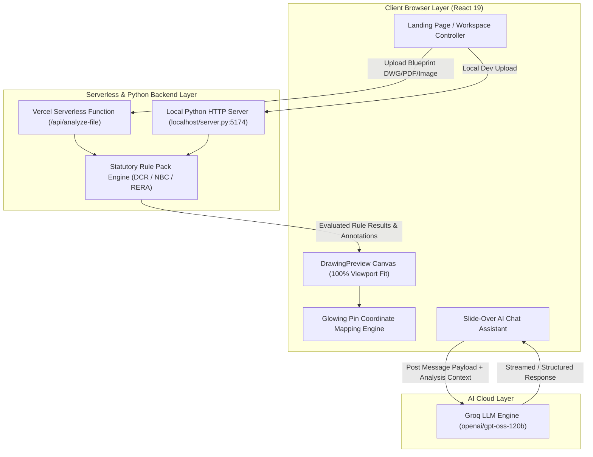
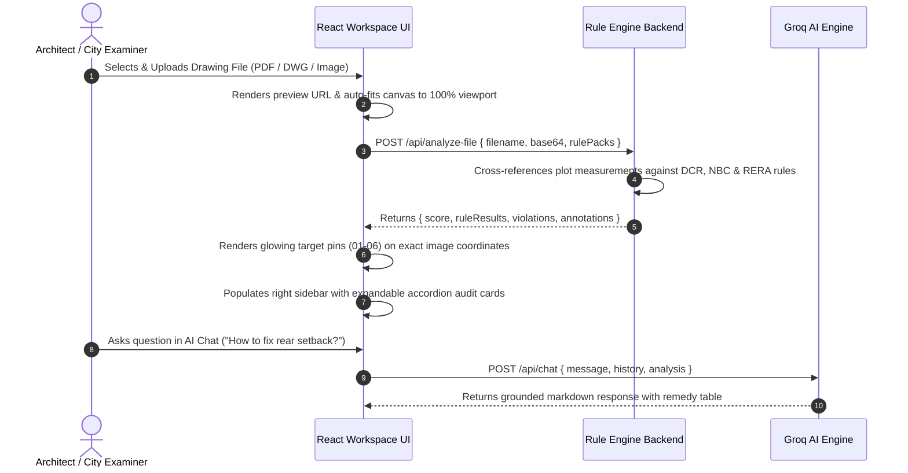

# System Architecture & Pipeline Flow
## PRUDENCE AI — SIH 2026 Open Innovation

---

## 1. End-to-End System Architecture

---

## 2. Drawing Canvas Viewport Fitting & Pin Coordinate Math

To ensure that uploaded architectural blueprint sheets fit 100% inside the viewport without requiring vertical scrolling, the image container and pin overlay engine use exact relative coordinate bounds.

### 2.1 Viewport Fit Formula
$$\text{Max Canvas Height} = \text{100vh} - \text{Header Height (56px)} - \text{Controls Bar Height (50px)} - \text{Padding (124px)} = \text{calc}(100\text{vh} - 230\text{px})$$

### 2.2 Pin Callout Coordinate Transformation
Pointer pins are embedded inside a tight `relative inline-flex` wrapper matching the rendered drawing image dimensions exactly (`object-contain`).

Given normalized annotation coordinates $(x_{\text{pct}}, y_{\text{pct}})$ where $x_{\text{pct}}, y_{\text{pct}} \in [0, 100]$:
$$\text{CSS Position: } \text{left} = x_{\text{pct}}\%, \quad \text{top} = y_{\text{pct}}\%, \quad \text{transform} = \text{translate}(-50\%, -50\%)$$

This guarantees that even when the window is resized, pins remain locked to their exact features on the drawing image (e.g., Rear Setback box at `14.5%, 13.0%`, Typical Floor Plan stair core at `33.5%, 16.0%`).

---

## 3. Statutory Compliance Score Algorithm

The overall Statutory Compliance Score $S$ is calculated dynamically as the ratio of passed rules to total applicable rules evaluated:

$$S = \text{round}\left( \frac{N_{\text{Pass}}}{\max(N_{\text{Total}}, 1)} \times 100 \right)$$

Where:
- $N_{\text{Pass}}$ = Count of evaluated rules returning status `Pass`.
- $N_{\text{Total}}$ = Total count of evaluated rules selected in the active rule pack session.

### Risk Level Categorization:
- **Low Risk**: $S \ge 70\%$
- **Medium Risk**: $40\% \le S < 70\%$
- **High Risk**: $S < 40\%$

---

## 4. Sequence Diagram: Plan Upload to Audit Report

